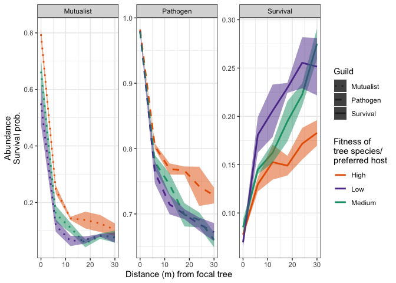
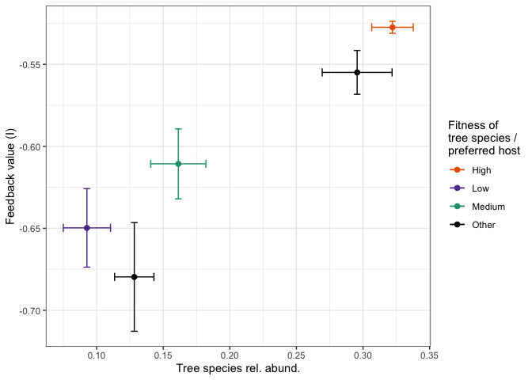
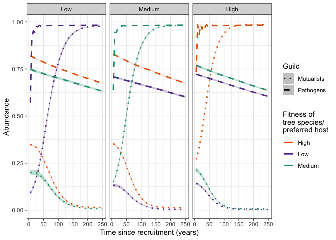
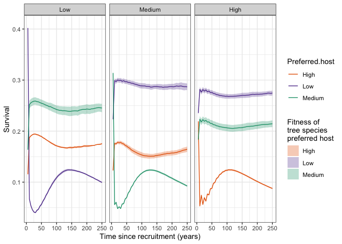
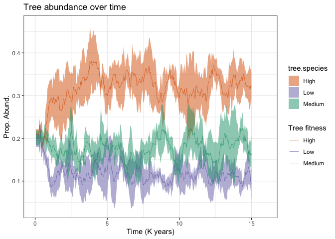

README
================
John Schroeder
4/5/2020

# Introduction

The following R project includes code necessary to run the simulation
for the manuscript entitled “Mutualist and pathogen traits interact to
affect plant community structure in a spatially explicit model.” All
functions necessary to run the simulation are included in
Simulation\_functions.R. We also include results from 16K simulations
runs using random parameter values in
./RunFiles/sim\_results\_random.RData. Simulation results from the
step-wise optimization are stored in files labeled
./RunFiles/sim\_opt\_step\*.RData. This project is archived under:
[](https://doi.org/10.5281/zenodo.3735452)

The following R packages are required to run the simulation

``` r
library(doSNOW) #For parallelizing simulation runs
library(randomForest) #For conducting random forest analyses between batches of runs (used for optimization)
library(abind) #For binding lists of results
library(poweRlaw) #For generating dispersal kernels
library(vegan)
library(dplyr) #For plotting
library(plotrix) #For plotting
library(ggplot2) #For plotting
library(RColorBrewer) #For plotting
```

Source code for the simulation functions and plotting functions:

``` r
source("./Simulation_functions.R")
source("./Simulation_plotting_functions.R")
```

The following code chunks conduct an example simulation run using the
parameter values presented in Table 1 of Schroeder et al. (2020, Nature
Communications)

``` r
numcores <- 4 #Define the number of cores to use to simultaneously run multiple simulations
cl <- parallel::makeCluster(numcores) #Create cluster
registerDoSNOW(cl) #Register cluster
```

Define parameter values and settings for simulation runs (this example
runs simulations with identical parameter values four times):

``` r
load("./RunFiles/position.RData")
number.of.runs <- 4
particle.positions <- as.data.frame(position[rep(1,number.of.runs),])
tree.species <- 5
trees.in.forest <- 499
mort <- 0.1
mortality.replacement.steps <- 3000
eliminate.feedback <- c(rep(FALSE,number.of.runs))
fix.feedback <- c(rep(FALSE,number.of.runs))
remove.mutualists <- c(rep(FALSE,number.of.runs))
remove.pathogens <- c(rep(FALSE,number.of.runs))
f.vals <- t(sapply(particle.positions[,4],function(x) {(c(1:tree.species-1)/(tree.species-1))*(1-x)+x}))
pb <- txtProgressBar(max = number.of.runs, style = 3)
```

    ##   |                                                                              |                                                                      |   0%

``` r
progress <- function(n) setTxtProgressBar(pb, n)
opts <- list(progress = progress)
```

Run multiple simulations using the ‘dopar’ function, and store the
output in a list called simulation.results:

``` r
simulation.results <- foreach(g = particle.positions$g,
                                  h = particle.positions$h,
                                  b.t = particle.positions$b.t,
                                  s.m = particle.positions$s.m,
                                  b.m = particle.positions$b.m,
                                  alpha.m = particle.positions$alpha.m,
                                  gamma.m = particle.positions$gamma.m,
                                  r.m = particle.positions$r.m,
                                  q.m = particle.positions$q.m,
                                  c.m = particle.positions$c.m,
                                  s.p = particle.positions$s.p,
                                  b.p = particle.positions$b.p,
                                  alpha.p = particle.positions$alpha.p,
                                  gamma.p =particle.positions$gamma.p,
                                  r.p = particle.positions$r.p,
                                  q.p = particle.positions$q.p,
                                  c.p = particle.positions$c.p,
                                  fix.feedback = fix.feedback,
                                  eliminate.feedback = eliminate.feedback,
                                  remove.mutualists = remove.mutualists,
                                  remove.pathogens = remove.pathogens,
                                  index = c(1:number.of.runs),
                                  .packages = c("poweRlaw","vegan"), .options.snow = opts) %dopar%
        (
        psf.simulation(m = trees.in.forest,
                            mort = mort,
                            tree.species = tree.species,
                            mutualist.species.per.tree = 1,
                            pathogen.species.per.tree = 1,
                            time.steps = mortality.replacement.steps,
                            mutualist.effect.function.consp = mutualist.effect.function.consp, 
                            mutualist.effect.function.heterosp = mutualist.effect.function.heterosp,
                            pathogen.effect.function.consp = pathogen.effect.function.consp,
                            pathogen.effect.function.heterosp = pathogen.effect.function.heterosp,
                            g = g,
                            h = h,
                            s.p = s.p,
                            s.m = s.m,
                            b.p = b.p,
                            b.m = b.m,
                            b.t = b.t,
                            f.vals = rev(f.vals[index,]),
                            index = index,
                            gamma.m = gamma.m,
                            gamma.p = gamma.p,
                            r.m = r.m,
                            r.p = r.p,
                            q.m = q.m,
                            q.p = q.p,
                            c.m = c.m,
                            c.p = c.p,
                            alpha.m = alpha.m,
                            alpha.p = alpha.p,
                            fix.feedback = fix.feedback,
                            eliminate.feedback = eliminate.feedback,
                            remove.mutualists = remove.mutualists,
                            remove.pathogens = remove.pathogens,
                            initiate.forest.matrix = initiate.forest.matrix,
                            initiate.fungal.matrix = initiate.fungal.matrix,
                            trial.function = trial.function,
                            dispersal.function = dpldis,
                            microbe.dispersal.function = dpldis,
                            track.over.time = TRUE))
```

    ##   |                                                                              |==================                                                    |  25%  |                                                                              |===================================                                   |  50%  |                                                                              |====================================================                  |  75%  |                                                                              |======================================================================| 100%

Plot results analogous to those presented in Figure 1a and 1b (these
will likely be noisy with just 4 simulation
runs)

``` r
mutualist.spatial.patterns <- calculate.microbes.through.space(modelOutput = simulation.results, mu.or.pa = "mu",indices = c(1:4),ncells=5)
pathogen.spatial.patterns <- calculate.microbes.through.space(modelOutput = simulation.results, mu.or.pa = "pa",indices = c(1:4), ncells=5)
survival.spatial.patterns <- plot.survival.through.space(simulation.results,indices = c(1:4),ncells = 5,fitness.dif=FALSE)
fungi.abund.plot <- plot.microbes.through.space(mutualist.spatial.patterns,pathogen.spatial.patterns,survival.spatial.patterns)
fungi.abund.plot
```

<!-- --> Plot results
analogous to those in Fig 1c

``` r
PSF.strength <- foreach(index=c(1:4)) %do% ( #Run in sequence
  measure.PSF.strength(modelOutput = simulation.results[[index]],dpldis))

psf.plot <- plot.feedback.per.species(cndd.strength = PSF.strength,simulation.results = simulation.results,index=c(1:4))

psf.plot
```

<!-- --> Plot results
analogous to those in 2a. These use average results from one simulation,
but results do not vary much from simulation to
simulation

``` r
mutualists.over.time <- calculate.microbes.over.time.single.tree(simulation.results,"mu",time.steps=50,step.range=c(50:3000),indices = c(1:4))
<<<<<<< HEAD
pathogens.over.time <- calculate.microbes.over.time.single.tree(simulation.results,"pa",time.steps=50,step.range=c(50:3000), indices = c(1:4))
=======
<<<<<<< HEAD
pathogens.over.time <- calculate.microbes.over.time.single.tree(simulation.results,"pa",time.steps=50,step.range=c(50:3000), indices = c(1:4))
=======
```

    ##     Focal.tree Preferred.host   Abundance Time
    ## 1         High           High 0.281162863    5
    ## 2       Medium           High 0.377081762    5
    ## 3          Low           High 0.367727938    5
    ## 4         High         Medium 0.214358199    5
    ## 5       Medium         Medium 0.142021846    5
    ## 6          Low         Medium 0.193074722    5
    ## 7         High            Low 0.135173011    5
    ## 8       Medium            Low 0.126443267    5
    ## 9          Low            Low 0.088713680    5
    ## 10        High           High 0.306414511   10
    ## 11      Medium           High 0.373698171   10
    ## 12         Low           High 0.367354418   10
    ## 13        High         Medium 0.208491847   10
    ## 14      Medium         Medium 0.159120441   10
    ## 15         Low         Medium 0.194590652   10
    ## 16        High            Low 0.131158251   10
    ## 17      Medium            Low 0.126855667   10
    ## 18         Low            Low 0.100167042   10
    ## 19        High           High 0.347391838   15
    ## 20      Medium           High 0.366672747   15
    ## 21         Low           High 0.364715603   15
    ## 22        High         Medium 0.200365289   15
    ## 23      Medium         Medium 0.186137870   15
    ## 24         Low         Medium 0.194314522   15
    ## 25        High            Low 0.126865681   15
    ## 26      Medium            Low 0.126129382   15
    ## 27         Low            Low 0.119137460   15
    ## 28        High           High 0.389375867   20
    ## 29      Medium           High 0.357613326   20
    ## 30         Low           High 0.357643809   20
    ## 31        High         Medium 0.191174076   20
    ## 32      Medium         Medium 0.215609656   20
    ## 33         Low         Medium 0.195099464   20
    ## 34        High            Low 0.120668928   20
    ## 35      Medium            Low 0.123382312   20
    ## 36         Low            Low 0.139451885   20
    ## 37        High           High 0.437168498   25
    ## 38      Medium           High 0.345792085   25
    ## 39         Low           High 0.348156736   25
    ## 40        High         Medium 0.180496159   25
    ## 41      Medium         Medium 0.252041959   25
    ## 42         Low         Medium 0.191989143   25
    ## 43        High            Low 0.113405049   25
    ## 44      Medium            Low 0.120413083   25
    ## 45         Low            Low 0.165862816   25
    ## 46        High           High 0.487881250   30
    ## 47      Medium           High 0.332805946   30
    ## 48         Low           High 0.340236467   30
    ## 49        High         Medium 0.167836646   30
    ## 50      Medium         Medium 0.294357425   30
    ## 51         Low         Medium 0.188166875   30
    ## 52        High            Low 0.105917543   30
    ## 53      Medium            Low 0.115487055   30
    ## 54         Low            Low 0.195466622   30
    ## 55        High           High 0.541620638   35
    ## 56      Medium           High 0.314757902   35
    ## 57         Low           High 0.329200513   35
    ## 58        High         Medium 0.153997414   35
    ## 59      Medium         Medium 0.344198642   35
    ## 60         Low         Medium 0.184565128   35
    ## 61        High            Low 0.097390071   35
    ## 62      Medium            Low 0.110371694   35
    ## 63         Low            Low 0.229234598   35
    ## 64        High           High 0.596870765   40
    ## 65      Medium           High 0.296319983   40
    ## 66         Low           High 0.316120358   40
    ## 67        High         Medium 0.138918587   40
    ## 68      Medium         Medium 0.393970798   40
    ## 69         Low         Medium 0.178381411   40
    ## 70        High            Low 0.088211632   40
    ## 71      Medium            Low 0.105463391   40
    ## 72         Low            Low 0.270320015   40
    ## 73        High           High 0.650295631   45
    ## 74      Medium           High 0.274989374   45
    ## 75         Low           High 0.301285678   45
    ## 76        High         Medium 0.123373711   45
    ## 77      Medium         Medium 0.447745660   45
    ## 78         Low         Medium 0.170775530   45
    ## 79        High            Low 0.078521217   45
    ## 80      Medium            Low 0.098419705   45
    ## 81         Low            Low 0.313195035   45
    ## 82        High           High 0.698961406   50
    ## 83      Medium           High 0.250869719   50
    ## 84         Low           High 0.287368934   50
    ## 85        High         Medium 0.108484230   50
    ## 86      Medium         Medium 0.502730106   50
    ## 87         Low         Medium 0.163264287   50
    ## 88        High            Low 0.069541338   50
    ## 89      Medium            Low 0.091294903   50
    ## 90         Low            Low 0.358051424   50
    ## 91        High           High 0.743256440   55
    ## 92      Medium           High 0.227191565   55
    ## 93         Low           High 0.269079786   55
    ## 94        High         Medium 0.094455288   55
    ## 95      Medium         Medium 0.556076142   55
    ## 96         Low         Medium 0.154682365   55
    ## 97        High            Low 0.060659388   55
    ## 98      Medium            Low 0.083214143   55
    ## 99         Low            Low 0.406591342   55
    ## 100       High           High 0.782114498   60
    ## 101     Medium           High 0.202724591   60
    ## 102        Low           High 0.251495609   60
    ## 103       High         Medium 0.081182656   60
    ## 104     Medium         Medium 0.608134966   60
    ## 105        Low         Medium 0.146142795   60
    ## 106       High            Low 0.052900426   60
    ## 107     Medium            Low 0.075919663   60
    ## 108        Low            Low 0.452753641   60
    ## 109       High           High 0.815907585   65
    ## 110     Medium           High 0.180435348   65
    ## 111        Low           High 0.233561278   65
    ## 112       High         Medium 0.070056181   65
    ## 113     Medium         Medium 0.653874344   65
    ## 114        Low         Medium 0.135020056   65
    ## 115       High            Low 0.045772979   65
    ## 116     Medium            Low 0.069233115   65
    ## 117        Low            Low 0.499145479   65
    ## 118       High           High 0.844810507   70
    ## 119     Medium           High 0.159987944   70
    ## 120        Low           High 0.215938474   70
    ## 121       High         Medium 0.060028088   70
    ## 122     Medium         Medium 0.695547964   70
    ## 123        Low         Medium 0.125832316   70
    ## 124       High            Low 0.039208077   70
    ## 125     Medium            Low 0.062731336   70
    ## 126        Low            Low 0.542950480   70
    ## 127       High           High 0.869644771   75
    ## 128     Medium           High 0.140142937   75
    ## 129        Low           High 0.195688832   75
    ## 130       High         Medium 0.051036769   75
    ## 131     Medium         Medium 0.735558989   75
    ## 132        Low         Medium 0.117090562   75
    ## 133       High            Low 0.033580825   75
    ## 134     Medium            Low 0.056082538   75
    ## 135        Low            Low 0.586968785   75
    ## 136       High           High 0.890646146   80
    ## 137     Medium           High 0.122309263   80
    ## 138        Low           High 0.176442103   80
    ## 139       High         Medium 0.043105568   80
    ## 140     Medium         Medium 0.769357499   80
    ## 141        Low         Medium 0.108041901   80
    ## 142       High            Low 0.028435620   80
    ## 143     Medium            Low 0.049823333   80
    ## 144        Low            Low 0.628016541   80
    ## 145       High           High 0.907737993   85
    ## 146     Medium           High 0.106280364   85
    ## 147        Low           High 0.160389034   85
    ## 148       High         Medium 0.036574594   85
    ## 149     Medium         Medium 0.800174874   85
    ## 150        Low         Medium 0.098378227   85
    ## 151       High            Low 0.024471047   85
    ## 152     Medium            Low 0.044409178   85
    ## 153        Low            Low 0.663887308   85
    ## 154       High           High 0.922257270   90
    ## 155     Medium           High 0.091672808   90
    ## 156        Low           High 0.142121998   90
    ## 157       High         Medium 0.031124191   90
    ## 158     Medium         Medium 0.827377602   90
    ## 159        Low         Medium 0.088858341   90
    ## 160       High            Low 0.020932554   90
    ## 161     Medium            Low 0.039551839   90
    ## 162        Low            Low 0.703329228   90
    ## 163       High           High 0.934022377   95
    ## 164     Medium           High 0.079180477   95
    ## 165        Low           High 0.126727266   95
    ## 166       High         Medium 0.026642125   95
    ## 167     Medium         Medium 0.850837646   95
    ## 168        Low         Medium 0.079779642   95
    ## 169       High            Low 0.018016962   95
    ## 170     Medium            Low 0.034892055   95
    ## 171        Low            Low 0.737898461   95
    ## 172       High           High 0.944101007  100
    ## 173     Medium           High 0.067752655  100
    ## 174        Low           High 0.110571149  100
    ## 175       High         Medium 0.022700492  100
    ## 176     Medium         Medium 0.872166922  100
    ## 177        Low         Medium 0.071192631  100
    ## 178       High            Low 0.015394187  100
    ## 179     Medium            Low 0.030505132  100
    ## 180        Low            Low 0.770682732  100
    ## 181       High           High 0.952127773  105
    ## 182     Medium           High 0.058829285  105
    ## 183        Low           High 0.098308863  105
    ## 184       High         Medium 0.019543196  105
    ## 185     Medium         Medium 0.889198671  105
    ## 186        Low         Medium 0.063843990  105
    ## 187       High            Low 0.013344242  105
    ## 188     Medium            Low 0.026779869  105
    ## 189        Low            Low 0.796987844  105
    ## 190       High           High 0.959162946  110
    ## 191     Medium           High 0.051251521  110
    ## 192        Low           High 0.085792906  110
    ## 193       High         Medium 0.016830337  110
    ## 194     Medium         Medium 0.903368443  110
    ## 195        Low         Medium 0.056880190  110
    ## 196       High            Low 0.011429431  110
    ## 197     Medium            Low 0.023855513  110
    ## 198        Low            Low 0.823410566  110
    ## 199       High           High 0.964708864  115
    ## 200     Medium           High 0.044420908  115
    ## 201        Low           High 0.076008613  115
    ## 202       High         Medium 0.014599421  115
    ## 203     Medium         Medium 0.917061512  115
    ## 204        Low         Medium 0.050630219  115
    ## 205       High            Low 0.009945607  115
    ## 206     Medium            Low 0.020741252  115
    ## 207        Low            Low 0.844422491  115
    ## 208       High           High 0.969180319  120
    ## 209     Medium           High 0.038596025  120
    ## 210        Low           High 0.066438140  120
    ## 211       High         Medium 0.012878321  120
    ## 212     Medium         Medium 0.928470910  120
    ## 213        Low         Medium 0.044310390  120
    ## 214       High            Low 0.008691764  120
    ## 215     Medium            Low 0.018075710  120
    ## 216        Low            Low 0.864642424  120
    ## 217       High           High 0.972815110  125
    ## 218     Medium           High 0.033947832  125
    ## 219        Low           High 0.058939981  125
    ## 220       High         Medium 0.011472959  125
    ## 221     Medium         Medium 0.937692798  125
    ## 222        Low         Medium 0.039648561  125
    ## 223       High            Low 0.007704828  125
    ## 224     Medium            Low 0.015920872  125
    ## 225        Low            Low 0.880820609  125
    ## 226       High           High 0.975566635  130
    ## 227     Medium           High 0.029995757  130
    ## 228        Low           High 0.052212486  130
    ## 229       High         Medium 0.010437636  130
    ## 230     Medium         Medium 0.945721786  130
    ## 231        Low         Medium 0.034959930  130
    ## 232       High            Low 0.006957167  130
    ## 233     Medium            Low 0.013766706  130
    ## 234        Low            Low 0.895294775  130
    ## 235       High           High 0.977736425  135
    ## 236     Medium           High 0.026770223  135
    ## 237        Low           High 0.045552817  135
    ## 238       High         Medium 0.009577601  135
    ## 239     Medium         Medium 0.952096749  135
    ## 240        Low         Medium 0.030593504  135
    ## 241       High            Low 0.006346151  135
    ## 242     Medium            Low 0.012336171  135
    ## 243        Low            Low 0.908915411  135
    ## 244       High           High 0.979451125  140
    ## 245     Medium           High 0.024481688  140
    ## 246        Low           High 0.040755558  140
    ## 247       High         Medium 0.008935895  140
    ## 248     Medium         Medium 0.957138605  140
    ## 249        Low         Medium 0.026857066  140
    ## 250       High            Low 0.005844778  140
    ## 251     Medium            Low 0.011010373  140
    ## 252        Low            Low 0.919751307  140
    ## 253       High           High 0.980765896  145
    ## 254     Medium           High 0.022153610  145
    ## 255        Low           High 0.035532584  145
    ## 256       High         Medium 0.008437450  145
    ## 257     Medium         Medium 0.962319452  145
    ## 258        Low         Medium 0.022823529  145
    ## 259       High            Low 0.005429664  145
    ## 260     Medium            Low 0.009616465  145
    ## 261        Low            Low 0.930820787  145
    ## 262       High           High 0.981789688  150
    ## 263     Medium           High 0.020513289  150
    ## 264        Low           High 0.032084237  150
    ## 265       High         Medium 0.008027761  150
    ## 266     Medium         Medium 0.965767254  150
    ## 267        Low         Medium 0.020354277  150
    ## 268       High            Low 0.005136038  150
    ## 269     Medium            Low 0.008642641  150
    ## 270        Low            Low 0.938072778  150
    ## 271       High           High 0.982571813  155
    ## 272     Medium           High 0.019185761  155
    ## 273        Low           High 0.028718794  155
    ## 274       High         Medium 0.007744617  155
    ## 275     Medium         Medium 0.968853492  155
    ## 276        Low         Medium 0.018048472  155
    ## 277       High            Low 0.004851014  155
    ## 278     Medium            Low 0.007716918  155
    ## 279        Low            Low 0.945533371  155
    ## 280       High           High 0.983238659  160
    ## 281     Medium           High 0.018287413  160
    ## 282        Low           High 0.026001884  160
    ## 283       High         Medium 0.007518167  160
    ## 284     Medium         Medium 0.970869711  160
    ## 285        Low         Medium 0.016240173  160
    ## 286       High            Low 0.004630524  160
    ## 287     Medium            Low 0.007135077  160
    ## 288        Low            Low 0.951150639  160
    ## 289       High           High 0.983794007  165
    ## 290     Medium           High 0.017452940  165
    ## 291        Low           High 0.023820535  165
    ## 292       High         Medium 0.007320116  165
    ## 293     Medium         Medium 0.972838317  165
    ## 294        Low         Medium 0.014393122  165
    ## 295       High            Low 0.004446543  165
    ## 296     Medium            Low 0.006535470  165
    ## 297        Low            Low 0.956273151  165
    ## 298       High           High 0.984225244  170
    ## 299     Medium           High 0.016811846  170
    ## 300        Low           High 0.021938873  170
    ## 301       High         Medium 0.007190903  170
    ## 302     Medium         Medium 0.974545671  170
    ## 303        Low         Medium 0.013309073  170
    ## 304       High            Low 0.004285614  170
    ## 305     Medium            Low 0.005987838  170
    ## 306        Low            Low 0.960205645  170
    ## 307       High           High 0.984531865  175
    ## 308     Medium           High 0.016303231  175
    ## 309        Low           High 0.020852362  175
    ## 310       High         Medium 0.007097383  175
    ## 311     Medium         Medium 0.975769904  175
    ## 312        Low         Medium 0.012373226  175
    ## 313       High            Low 0.004157716  175
    ## 314     Medium            Low 0.005575671  175
    ## 315        Low            Low 0.962957482  175
    ## 316       High           High 0.984826204  180
    ## 317     Medium           High 0.015921271  180
    ## 318        Low           High 0.019483775  180
    ## 319       High         Medium 0.006988383  180
    ## 320     Medium         Medium 0.976635308  180
    ## 321        Low         Medium 0.011369583  180
    ## 322       High            Low 0.004071706  180
    ## 323     Medium            Low 0.005291707  180
    ## 324        Low            Low 0.966110508  180
    ## 325       High           High 0.985068497  185
    ## 326     Medium           High 0.015694847  185
    ## 327        Low           High 0.018808989  185
    ## 328       High         Medium 0.006904012  185
    ## 329     Medium         Medium 0.977432943  185
    ## 330        Low         Medium 0.010710878  185
    ## 331       High            Low 0.003952094  185
    ## 332     Medium            Low 0.005045791  185
    ## 333        Low            Low 0.967812285  185
    ## 334       High           High 0.985264985  190
    ## 335     Medium           High 0.015514125  190
    ## 336        Low           High 0.018359310  190
    ## 337       High         Medium 0.006820261  190
    ## 338     Medium         Medium 0.978016304  190
    ## 339        Low         Medium 0.010231470  190
    ## 340       High            Low 0.003852140  190
    ## 341     Medium            Low 0.004828928  190
    ## 342        Low            Low 0.969236326  190
    ## 343       High           High 0.985466320  195
    ## 344     Medium           High 0.015350325  195
    ## 345        Low           High 0.017751490  195
    ## 346       High         Medium 0.006707289  195
    ## 347     Medium         Medium 0.978479356  195
    ## 348        Low         Medium 0.009796898  195
    ## 349       High            Low 0.003798408  195
    ## 350     Medium            Low 0.004652419  195
    ## 351        Low            Low 0.970652730  195
    ## 352       High           High 0.985666921  200
    ## 353     Medium           High 0.015135575  200
    ## 354        Low           High 0.017273834  200
    ## 355       High         Medium 0.006606145  200
    ## 356     Medium         Medium 0.978935975  200
    ## 357        Low         Medium 0.009298388  200
    ## 358       High            Low 0.003731313  200
    ## 359     Medium            Low 0.004490133  200
    ## 360        Low            Low 0.972004523  200
    ## 361       High           High 0.985830562  205
    ## 362     Medium           High 0.014975075  205
    ## 363        Low           High 0.016896002  205
    ## 364       High         Medium 0.006563055  205
    ## 365     Medium         Medium 0.979296330  205
    ## 366        Low         Medium 0.009160544  205
    ## 367       High            Low 0.003667759  205
    ## 368     Medium            Low 0.004339593  205
    ## 369        Low            Low 0.972591523  205
    ## 370       High           High 0.985937009  210
    ## 371     Medium           High 0.014812198  210
    ## 372        Low           High 0.016694571  210
    ## 373       High         Medium 0.006510977  210
    ## 374     Medium         Medium 0.979590531  210
    ## 375        Low         Medium 0.008967623  210
    ## 376       High            Low 0.003622994  210
    ## 377     Medium            Low 0.004245933  210
    ## 378        Low            Low 0.973203871  210
    ## 379       High           High 0.986092761  215
    ## 380     Medium           High 0.014749934  215
    ## 381        Low           High 0.016405691  215
    ## 382       High         Medium 0.006463571  215
    ## 383     Medium         Medium 0.979802502  215
    ## 384        Low         Medium 0.008859528  215
    ## 385       High            Low 0.003554140  215
    ## 386     Medium            Low 0.004133771  215
    ## 387        Low            Low 0.973869005  215
    ## 388       High           High 0.986202471  220
    ## 389     Medium           High 0.014636896  220
    ## 390        Low           High 0.016020629  220
    ## 391       High         Medium 0.006442368  220
    ## 392     Medium         Medium 0.980072665  220
    ## 393        Low         Medium 0.008560829  220
    ## 394       High            Low 0.003507756  220
    ## 395     Medium            Low 0.004115204  220
    ## 396        Low            Low 0.974891835  220
    ## 397       High           High 0.986321879  225
    ## 398     Medium           High 0.014485998  225
    ## 399        Low           High 0.015764882  225
    ## 400       High         Medium 0.006394604  225
    ## 401     Medium         Medium 0.980231809  225
    ## 402        Low         Medium 0.008137333  225
    ## 403       High            Low 0.003460508  225
    ## 404     Medium            Low 0.004091973  225
    ## 405        Low            Low 0.975864600  225
    ## 406       High           High 0.986453262  230
    ## 407     Medium           High 0.014442310  230
    ## 408        Low           High 0.015612148  230
    ## 409       High         Medium 0.006329160  230
    ## 410     Medium         Medium 0.980348647  230
    ## 411        Low         Medium 0.008005599  230
    ## 412       High            Low 0.003440755  230
    ## 413     Medium            Low 0.004039321  230
    ## 414        Low            Low 0.976242398  230
    ## 415       High           High 0.986544445  235
    ## 416     Medium           High 0.014360137  235
    ## 417        Low           High 0.015666377  235
    ## 418       High         Medium 0.006296526  235
    ## 419     Medium         Medium 0.980453395  235
    ## 420        Low         Medium 0.007865327  235
    ## 421       High            Low 0.003405069  235
    ## 422     Medium            Low 0.003967191  235
    ## 423        Low            Low 0.976548680  235
    ## 424       High           High 0.986627803  240
    ## 425     Medium           High 0.014325091  240
    ## 426        Low           High 0.015716186  240
    ## 427       High         Medium 0.006199237  240
    ## 428     Medium         Medium 0.980524601  240
    ## 429        Low         Medium 0.007794903  240
    ## 430       High            Low 0.003384617  240
    ## 431     Medium            Low 0.003939850  240
    ## 432        Low            Low 0.976765112  240
    ## 433       High           High 0.986766045  245
    ## 434     Medium           High 0.014289629  245
    ## 435        Low           High 0.015564195  245
    ## 436       High         Medium 0.006115119  245
    ## 437     Medium         Medium 0.980603224  245
    ## 438        Low         Medium 0.007856902  245
    ## 439       High            Low 0.003320533  245
    ## 440     Medium            Low 0.003960528  245
    ## 441        Low            Low 0.976883630  245
    ## 442       High           High 0.986824819  250
    ## 443     Medium           High 0.014266206  250
    ## 444        Low           High 0.015625952  250
    ## 445       High         Medium 0.006091417  250
    ## 446     Medium         Medium 0.980609533  250
    ## 447        Low         Medium 0.007615938  250
    ## 448       High            Low 0.003292198  250
    ## 449     Medium            Low 0.003964354  250
    ## 450        Low            Low 0.976973847  250

``` r
pathogens.over.time <- calculate.microbes.over.time.single.tree(simulation.results,"pa",time.steps=50,step.range=c(50:3000), indices = c(1:4))
```

    ##     Focal.tree Preferred.host Abundance Time
    ## 1         High           High 0.7399280    5
    ## 2       Medium           High 0.8348022    5
    ## 3          Low           High 0.8225645    5
    ## 4         High         Medium 0.7689399    5
    ## 5       Medium         Medium 0.6341988    5
    ## 6          Low         Medium 0.7431335    5
    ## 7         High            Low 0.7182575    5
    ## 8       Medium            Low 0.7026697    5
    ## 9          Low            Low 0.5640033    5
    ## 10        High           High 0.9866063   10
    ## 11      Medium           High 0.8323999   10
    ## 12         Low           High 0.8199201   10
    ## 13        High         Medium 0.7668903   10
    ## 14      Medium         Medium 0.9435213   10
    ## 15         Low         Medium 0.7414985   10
    ## 16        High            Low 0.7167636   10
    ## 17      Medium            Low 0.7011817   10
    ## 18         Low            Low 0.8981061   10
    ## 19        High           High 0.9316599   15
    ## 20      Medium           High 0.8283383   15
    ## 21         Low           High 0.8153064   15
    ## 22        High         Medium 0.7633668   15
    ## 23      Medium         Medium 0.9425112   15
    ## 24         Low         Medium 0.7388165   15
    ## 25        High            Low 0.7138861   15
    ## 26      Medium            Low 0.6986392   15
    ## 27         Low            Low 0.9526142   15
    ## 28        High           High 0.9839907   20
    ## 29      Medium           High 0.8246355   20
    ## 30         Low           High 0.8100466   20
    ## 31        High         Medium 0.7602374   20
    ## 32      Medium         Medium 0.9623844   20
    ## 33         Low         Medium 0.7364782   20
    ## 34        High            Low 0.7110796   20
    ## 35      Medium            Low 0.6959888   20
    ## 36         Low            Low 0.9430249   20
    ## 37        High           High 0.9612357   25
    ## 38      Medium           High 0.8205297   25
    ## 39         Low           High 0.8050114   25
    ## 40        High         Medium 0.7567326   25
    ## 41      Medium         Medium 0.9688406   25
    ## 42         Low         Medium 0.7332810   25
    ## 43        High            Low 0.7085028   25
    ## 44      Medium            Low 0.6937281   25
    ## 45         Low            Low 0.9768463   25
    ## 46        High           High 0.9897926   30
    ## 47      Medium           High 0.8169510   30
    ## 48         Low           High 0.8023246   30
    ## 49        High         Medium 0.7538843   30
    ## 50      Medium         Medium 0.9806263   30
    ## 51         Low         Medium 0.7305350   30
    ## 52        High            Low 0.7061606   30
    ## 53      Medium            Low 0.6915829   30
    ## 54         Low            Low 0.9732290   30
    ## 55        High           High 0.9720329   35
    ## 56      Medium           High 0.8134277   35
    ## 57         Low           High 0.7983969   35
    ## 58        High         Medium 0.7508361   35
    ## 59      Medium         Medium 0.9772988   35
    ## 60         Low         Medium 0.7280115   35
    ## 61        High            Low 0.7032541   35
    ## 62      Medium            Low 0.6897197   35
    ## 63         Low            Low 0.9829725   35
    ## 64        High           High 0.9864374   40
    ## 65      Medium           High 0.8102054   40
    ## 66         Low           High 0.7940793   40
    ## 67        High         Medium 0.7478436   40
    ## 68      Medium         Medium 0.9817399   40
    ## 69         Low         Medium 0.7250475   40
    ## 70        High            Low 0.7005096   40
    ## 71      Medium            Low 0.6883667   40
    ## 72         Low            Low 0.9780914   40
    ## 73        High           High 0.9758635   45
    ## 74      Medium           High 0.8074323   45
    ## 75         Low           High 0.7910170   45
    ## 76        High         Medium 0.7448903   45
    ## 77      Medium         Medium 0.9789716   45
    ## 78         Low         Medium 0.7213875   45
    ## 79        High            Low 0.6978093   45
    ## 80      Medium            Low 0.6867596   45
    ## 81         Low            Low 0.9818496   45
    ## 82        High           High 0.9840906   50
    ## 83      Medium           High 0.8034650   50
    ## 84         Low           High 0.7887137   50
    ## 85        High         Medium 0.7412168   50
    ## 86      Medium         Medium 0.9815381   50
    ## 87         Low         Medium 0.7202055   50
    ## 88        High            Low 0.6954812   50
    ## 89      Medium            Low 0.6844456   50
    ## 90         Low            Low 0.9794349   50
    ## 91        High           High 0.9780413   55
    ## 92      Medium           High 0.7996867   55
    ## 93         Low           High 0.7855072   55
    ## 94        High         Medium 0.7388664   55
    ## 95      Medium         Medium 0.9796952   55
    ## 96         Low         Medium 0.7181314   55
    ## 97        High            Low 0.6931149   55
    ## 98      Medium            Low 0.6806215   55
    ## 99         Low            Low 0.9812990   55
    ## 100       High           High 0.9827711   60
    ## 101     Medium           High 0.7962402   60
    ## 102        Low           High 0.7817454   60
    ## 103       High         Medium 0.7352195   60
    ## 104     Medium         Medium 0.9813728   60
    ## 105        Low         Medium 0.7159341   60
    ## 106       High            Low 0.6902430   60
    ## 107     Medium            Low 0.6790361   60
    ## 108        Low            Low 0.9801825   60
    ## 109       High           High 0.9793322   65
    ## 110     Medium           High 0.7926277   65
    ## 111        Low           High 0.7792896   65
    ## 112       High         Medium 0.7320931   65
    ## 113     Medium         Medium 0.9801746   65
    ## 114        Low         Medium 0.7124578   65
    ## 115       High            Low 0.6879785   65
    ## 116     Medium            Low 0.6770642   65
    ## 117        Low            Low 0.9810695   65
    ## 118       High           High 0.9820874   70
    ## 119     Medium           High 0.7894103   70
    ## 120        Low           High 0.7773325   70
    ## 121       High         Medium 0.7288775   70
    ## 122     Medium         Medium 0.9811875   70
    ## 123        Low         Medium 0.7112409   70
    ## 124       High            Low 0.6852146   70
    ## 125     Medium            Low 0.6755502   70
    ## 126        Low            Low 0.9806056   70
    ## 127       High           High 0.9801214   75
    ## 128     Medium           High 0.7860082   75
    ## 129        Low           High 0.7725183   75
    ## 130       High         Medium 0.7253026   75
    ## 131     Medium         Medium 0.9805352   75
    ## 132        Low         Medium 0.7090468   75
    ## 133       High            Low 0.6828667   75
    ## 134     Medium            Low 0.6740867   75
    ## 135        Low            Low 0.9809783   75
    ## 136       High           High 0.9817808   80
    ## 137     Medium           High 0.7823221   80
    ## 138        Low           High 0.7696264   80
    ## 139       High         Medium 0.7220430   80
    ## 140     Medium         Medium 0.9811711   80
    ## 141        Low         Medium 0.7083171   80
    ## 142       High            Low 0.6801652   80
    ## 143     Medium            Low 0.6710961   80
    ## 144        Low            Low 0.9808893   80
    ## 145       High           High 0.9806107   85
    ## 146     Medium           High 0.7789751   85
    ## 147        Low           High 0.7662506   85
    ## 148       High         Medium 0.7189955   85
    ## 149     Medium         Medium 0.9808118   85
    ## 150        Low         Medium 0.7040334   85
    ## 151       High            Low 0.6781826   85
    ## 152     Medium            Low 0.6691030   85
    ## 153        Low            Low 0.9809978   85
    ## 154       High           High 0.9816623   90
    ## 155     Medium           High 0.7753537   90
    ## 156        Low           High 0.7633134   90
    ## 157       High         Medium 0.7166322   90
    ## 158     Medium         Medium 0.9812009   90
    ## 159        Low         Medium 0.7017144   90
    ## 160       High            Low 0.6762021   90
    ## 161     Medium            Low 0.6678245   90
    ## 162        Low            Low 0.9810371   90
    ## 163       High           High 0.9809521   95
    ## 164     Medium           High 0.7718826   95
    ## 165        Low           High 0.7610318   95
    ## 166       High         Medium 0.7143657   95
    ## 167     Medium         Medium 0.9810218   95
    ## 168        Low         Medium 0.6999358   95
    ## 169       High            Low 0.6742502   95
    ## 170     Medium            Low 0.6655100   95
    ## 171        Low            Low 0.9810973   95
    ## 172       High           High 0.9816307  100
    ## 173     Medium           High 0.7685503  100
    ## 174        Low           High 0.7566247  100
    ## 175       High         Medium 0.7114249  100
    ## 176     Medium         Medium 0.9813025  100
    ## 177        Low         Medium 0.6977052  100
    ## 178       High            Low 0.6713329  100
    ## 179     Medium            Low 0.6634384  100
    ## 180        Low            Low 0.9811881  100
    ## 181       High           High 0.9812306  105
    ## 182     Medium           High 0.7660924  105
    ## 183        Low           High 0.7550202  105
    ## 184       High         Medium 0.7081488  105
    ## 185     Medium         Medium 0.9812110  105
    ## 186        Low         Medium 0.6965802  105
    ## 187       High            Low 0.6682498  105
    ## 188     Medium            Low 0.6615024  105
    ## 189        Low            Low 0.9811918  105
    ## 190       High           High 0.9816880  110
    ## 191     Medium           High 0.7627832  110
    ## 192        Low           High 0.7518400  110
    ## 193       High         Medium 0.7056520  110
    ## 194     Medium         Medium 0.9813662  110
    ## 195        Low         Medium 0.6936255  110
    ## 196       High            Low 0.6652551  110
    ## 197     Medium            Low 0.6588983  110
    ## 198        Low            Low 0.9813139  110
    ## 199       High           High 0.9814552  115
    ## 200     Medium           High 0.7597158  115
    ## 201        Low           High 0.7503419  115
    ## 202       High         Medium 0.7022578  115
    ## 203     Medium         Medium 0.9813751  115
    ## 204        Low         Medium 0.6908659  115
    ## 205       High            Low 0.6626842  115
    ## 206     Medium            Low 0.6568158  115
    ## 207        Low            Low 0.9813013  115
    ## 208       High           High 0.9817810  120
    ## 209     Medium           High 0.7563551  120
    ## 210        Low           High 0.7477817  120
    ## 211       High         Medium 0.6994729  120
    ## 212     Medium         Medium 0.9814676  120
    ## 213        Low         Medium 0.6894427  120
    ## 214       High            Low 0.6597836  120
    ## 215     Medium            Low 0.6545870  120
    ## 216        Low            Low 0.9814095  120
    ## 217       High           High 0.9816550  125
    ## 218     Medium           High 0.7529962  125
    ## 219        Low           High 0.7460645  125
    ## 220       High         Medium 0.6962050  125
    ## 221     Medium         Medium 0.9815086  125
    ## 222        Low         Medium 0.6875968  125
    ## 223       High            Low 0.6571030  125
    ## 224     Medium            Low 0.6529489  125
    ## 225        Low            Low 0.9814772  125
    ## 226       High           High 0.9818804  130
    ## 227     Medium           High 0.7493138  130
    ## 228        Low           High 0.7439050  130
    ## 229       High         Medium 0.6930187  130
    ## 230     Medium         Medium 0.9815909  130
    ## 231        Low         Medium 0.6843285  130
    ## 232       High            Low 0.6550327  130
    ## 233     Medium            Low 0.6495972  130
    ## 234        Low            Low 0.9814757  130
    ## 235       High           High 0.9818310  135
    ## 236     Medium           High 0.7452484  135
    ## 237        Low           High 0.7401461  135
    ## 238       High         Medium 0.6901446  135
    ## 239     Medium         Medium 0.9816619  135
    ## 240        Low         Medium 0.6820216  135
    ## 241       High            Low 0.6528198  135
    ## 242     Medium            Low 0.6478774  135
    ## 243        Low            Low 0.9816171  135
    ## 244       High           High 0.9820120  140
    ## 245     Medium           High 0.7421895  140
    ## 246        Low           High 0.7370003  140
    ## 247       High         Medium 0.6871620  140
    ## 248     Medium         Medium 0.9817410  140
    ## 249        Low         Medium 0.6793298  140
    ## 250       High            Low 0.6501164  140
    ## 251     Medium            Low 0.6461166  140
    ## 252        Low            Low 0.9815966  140
    ## 253       High           High 0.9819671  145
    ## 254     Medium           High 0.7394957  145
    ## 255        Low           High 0.7344556  145
    ## 256       High         Medium 0.6845182  145
    ## 257     Medium         Medium 0.9817944  145
    ## 258        Low         Medium 0.6766382  145
    ## 259       High            Low 0.6469793  145
    ## 260     Medium            Low 0.6435712  145
    ## 261        Low            Low 0.9817314  145
    ## 262       High           High 0.9821625  150
    ## 263     Medium           High 0.7357641  150
    ## 264        Low           High 0.7325776  150
    ## 265       High         Medium 0.6822966  150
    ## 266     Medium         Medium 0.9819071  150
    ## 267        Low         Medium 0.6742087  150
    ## 268       High            Low 0.6455577  150
    ## 269     Medium            Low 0.6416767  150
    ## 270        Low            Low 0.9816727  150
    ## 271       High           High 0.9820953  155
    ## 272     Medium           High 0.7330807  155
    ## 273        Low           High 0.7290607  155
    ## 274       High         Medium 0.6798649  155
    ## 275     Medium         Medium 0.9819220  155
    ## 276        Low         Medium 0.6720452  155
    ## 277       High            Low 0.6429550  155
    ## 278     Medium            Low 0.6397363  155
    ## 279        Low            Low 0.9818310  155
    ## 280       High           High 0.9822755  160
    ## 281     Medium           High 0.7303601  160
    ## 282        Low           High 0.7260132  160
    ## 283       High         Medium 0.6770151  160
    ## 284     Medium         Medium 0.9820170  160
    ## 285        Low         Medium 0.6708994  160
    ## 286       High            Low 0.6412754  160
    ## 287     Medium            Low 0.6374751  160
    ## 288        Low            Low 0.9817665  160
    ## 289       High           High 0.9822379  165
    ## 290     Medium           High 0.7270231  165
    ## 291        Low           High 0.7234367  165
    ## 292       High         Medium 0.6743818  165
    ## 293     Medium         Medium 0.9820373  165
    ## 294        Low         Medium 0.6684162  165
    ## 295       High            Low 0.6389513  165
    ## 296     Medium            Low 0.6350342  165
    ## 297        Low            Low 0.9819837  165
    ## 298       High           High 0.9824053  170
    ## 299     Medium           High 0.7238899  170
    ## 300        Low           High 0.7198178  170
    ## 301       High         Medium 0.6718411  170
    ## 302     Medium         Medium 0.9821598  170
    ## 303        Low         Medium 0.6661975  170
    ## 304       High            Low 0.6365784  170
    ## 305     Medium            Low 0.6324651  170
    ## 306        Low            Low 0.9819027  170
    ## 307       High           High 0.9823898  175
    ## 308     Medium           High 0.7204718  175
    ## 309        Low           High 0.7164995  175
    ## 310       High         Medium 0.6689428  175
    ## 311     Medium         Medium 0.9822049  175
    ## 312        Low         Medium 0.6629651  175
    ## 313       High            Low 0.6343547  175
    ## 314     Medium            Low 0.6299044  175
    ## 315        Low            Low 0.9821454  175
    ## 316       High           High 0.9825156  180
    ## 317     Medium           High 0.7175499  180
    ## 318        Low           High 0.7141774  180
    ## 319       High         Medium 0.6664883  180
    ## 320     Medium         Medium 0.9822696  180
    ## 321        Low         Medium 0.6597527  180
    ## 322       High            Low 0.6319752  180
    ## 323     Medium            Low 0.6277475  180
    ## 324        Low            Low 0.9820633  180
    ## 325       High           High 0.9825690  185
    ## 326     Medium           High 0.7140172  185
    ## 327        Low           High 0.7118064  185
    ## 328       High         Medium 0.6641708  185
    ## 329     Medium         Medium 0.9823422  185
    ## 330        Low         Medium 0.6559419  185
    ## 331       High            Low 0.6294816  185
    ## 332     Medium            Low 0.6255030  185
    ## 333        Low            Low 0.9822850  185
    ## 334       High           High 0.9826201  190
    ## 335     Medium           High 0.7109784  190
    ## 336        Low           High 0.7095115  190
    ## 337       High         Medium 0.6612055  190
    ## 338     Medium         Medium 0.9824030  190
    ## 339        Low         Medium 0.6520923  190
    ## 340       High            Low 0.6275431  190
    ## 341     Medium            Low 0.6244223  190
    ## 342        Low            Low 0.9821909  190
    ## 343       High           High 0.9826968  195
    ## 344     Medium           High 0.7086728  195
    ## 345        Low           High 0.7073553  195
    ## 346       High         Medium 0.6583056  195
    ## 347     Medium         Medium 0.9824670  195
    ## 348        Low         Medium 0.6508037  195
    ## 349       High            Low 0.6250605  195
    ## 350     Medium            Low 0.6219123  195
    ## 351        Low            Low 0.9823834  195
    ## 352       High           High 0.9827931  200
    ## 353     Medium           High 0.7052099  200
    ## 354        Low           High 0.7037749  200
    ## 355       High         Medium 0.6549820  200
    ## 356     Medium         Medium 0.9825277  200
    ## 357        Low         Medium 0.6473717  200
    ## 358       High            Low 0.6227193  200
    ## 359     Medium            Low 0.6196536  200
    ## 360        Low            Low 0.9823932  200
    ## 361       High           High 0.9828142  205
    ## 362     Medium           High 0.7012447  205
    ## 363        Low           High 0.7002286  205
    ## 364       High         Medium 0.6521597  205
    ## 365     Medium         Medium 0.9826282  205
    ## 366        Low         Medium 0.6455706  205
    ## 367       High            Low 0.6206972  205
    ## 368     Medium            Low 0.6166248  205
    ## 369        Low            Low 0.9824715  205
    ## 370       High           High 0.9829435  210
    ## 371     Medium           High 0.6978364  210
    ## 372        Low           High 0.6987046  210
    ## 373       High         Medium 0.6492898  210
    ## 374     Medium         Medium 0.9826799  210
    ## 375        Low         Medium 0.6442215  210
    ## 376       High            Low 0.6186089  210
    ## 377     Medium            Low 0.6138189  210
    ## 378        Low            Low 0.9824855  210
    ## 379       High           High 0.9829407  215
    ## 380     Medium           High 0.6946975  215
    ## 381        Low           High 0.6950195  215
    ## 382       High         Medium 0.6467645  215
    ## 383     Medium         Medium 0.9827731  215
    ## 384        Low         Medium 0.6438070  215
    ## 385       High            Low 0.6164442  215
    ## 386     Medium            Low 0.6117009  215
    ## 387        Low            Low 0.9826270  215
    ## 388       High           High 0.9830838  220
    ## 389     Medium           High 0.6915693  220
    ## 390        Low           High 0.6915343  220
    ## 391       High         Medium 0.6441933  220
    ## 392     Medium         Medium 0.9828479  220
    ## 393        Low         Medium 0.6416175  220
    ## 394       High            Low 0.6140516  220
    ## 395     Medium            Low 0.6094869  220
    ## 396        Low            Low 0.9825958  220
    ## 397       High           High 0.9830767  225
    ## 398     Medium           High 0.6889813  225
    ## 399        Low           High 0.6883107  225
    ## 400       High         Medium 0.6418239  225
    ## 401     Medium         Medium 0.9828552  225
    ## 402        Low         Medium 0.6386468  225
    ## 403       High            Low 0.6114913  225
    ## 404     Medium            Low 0.6077470  225
    ## 405        Low            Low 0.9827062  225
    ## 406       High           High 0.9832160  230
    ## 407     Medium           High 0.6859486  230
    ## 408        Low           High 0.6847988  230
    ## 409       High         Medium 0.6386913  230
    ## 410     Medium         Medium 0.9829875  230
    ## 411        Low         Medium 0.6362967  230
    ## 412       High            Low 0.6095809  230
    ## 413     Medium            Low 0.6058420  230
    ## 414        Low            Low 0.9827476  230
    ## 415       High           High 0.9832040  235
    ## 416     Medium           High 0.6835477  235
    ## 417        Low           High 0.6821325  235
    ## 418       High         Medium 0.6361470  235
    ## 419     Medium         Medium 0.9829965  235
    ## 420        Low         Medium 0.6326683  235
    ## 421       High            Low 0.6073641  235
    ## 422     Medium            Low 0.6040700  235
    ## 423        Low            Low 0.9828233  235
    ## 424       High           High 0.9833164  240
    ## 425     Medium           High 0.6800453  240
    ## 426        Low           High 0.6793963  240
    ## 427       High         Medium 0.6333526  240
    ## 428     Medium         Medium 0.9830905  240
    ## 429        Low         Medium 0.6302503  240
    ## 430       High            Low 0.6053047  240
    ## 431     Medium            Low 0.6021824  240
    ## 432        Low            Low 0.9829229  240
    ## 433       High           High 0.9833554  245
    ## 434     Medium           High 0.6772676  245
    ## 435        Low           High 0.6784229  245
    ## 436       High         Medium 0.6309578  245
    ## 437     Medium         Medium 0.9831312  245
    ## 438        Low         Medium 0.6293152  245
    ## 439       High            Low 0.6036338  245
    ## 440     Medium            Low 0.6005244  245
    ## 441        Low            Low 0.9829285  245
    ## 442       High           High 0.9834140  250
    ## 443     Medium           High 0.6747943  250
    ## 444        Low           High 0.6754477  250
    ## 445       High         Medium 0.6285534  250
    ## 446     Medium         Medium 0.9832909  250
    ## 447        Low         Medium 0.6266790  250
    ## 448       High            Low 0.6016841  250
    ## 449     Medium            Low 0.5983077  250
    ## 450        Low            Low 0.9830588  250

``` r
>>>>>>> bc2c5b3d54e479de75dc60a0881fd5ec6263e731
>>>>>>> 7e0e7a1bfe066c4bc27393ca2559cb6f23e33b44
microbes.over.time <- plot.microbes.over.time(mutualists.over.time,pathogens.over.time)
microbes.over.time
```

<!-- -->

Plot results analogous to those in
2b

``` r
survival.over.time <- survival.over.time.single.tree(simulation.results,time.steps=50,step.range=c(50:3000),indices=c(1:4))
survival.over.time
```

<!-- --> Plot results
analogous to those in Fig 3a. Here, we display population dynamics from
the start of the simulation. There is no change in plant abundances for
the first 50 time steps because it represents a conditioning phase after
which we measure
PSF.

``` r
tree.abundances <- plot.tree.abundances.over.time(simulation.results,step.range=c(1:3000),indices = c(1:4),xlim=c(0,16))
tree.abundances
```

<!-- -->
